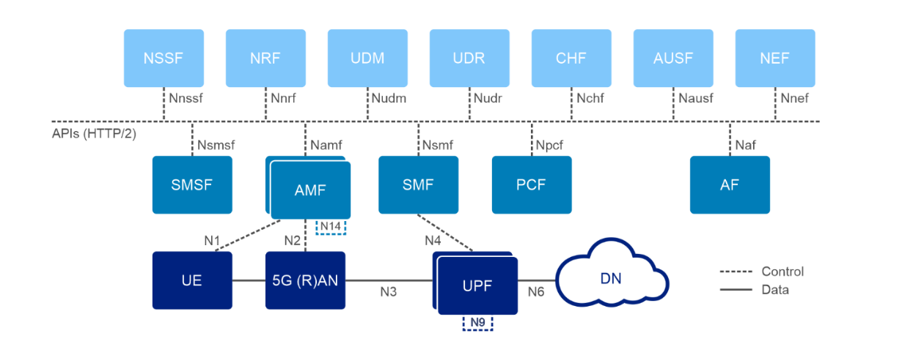

# 📡 5G Core & Radio Protocol Architecture  

## 5G Core Architecture  

  

### UE → RAN → 5GC → DN Path  
- **UE (User Equipment):** Smartphone, IoT device, or CPE first connects to the 5G New Radio (gNB).  
- **gNB:** Relays signaling and user traffic towards the 5G Core (5GC), which acts as the **brain** of the network.  
- **5GC:** Routes traffic to Data Networks (DN) → Internet, enterprise networks, or edge-cloud services.  

---

### Access and Mobility Management Function (AMF)  
- Control-plane anchor for the UE.  
- Handles **mobility management, registration, reachability, paging, authentication signaling**.  
- Think of it as the **"front desk"** of the 5G Core (signaling only, not user data).  

### Session Management Function (SMF)  
- Selected by the AMF based on UE’s service request.  
- Creates and maintains **PDU Sessions (data sessions)**.  
- Controls **User Plane Function (UPF)**: IP allocation, QoS, traffic steering.  

### User Plane Function (UPF)  
- The **data traffic engine** of 5G.  
- Forwards **IP packets** between UE ↔ external networks.  
- Supports **UL Classifier (UL-CL)** & **local breakout** (e.g., MEC/edge computing for low latency).  

### Authentication Server Function (AUSF)  
- Validates UE credentials using **5G-AKA or EAP-AKA’** protocols.  
- Works with **UDM** to fetch subscription profiles.  

### Unified Data Management (UDM) & Unified Data Repository (UDR)  
- Stores **subscriber data, profiles, authentication vectors**.  
- Provides service entitlements, data plans, and roaming policies.  

### Policy Control Function (PCF) & Application Function (AF)  
- **PCF:** Provides QoS and policy decisions (bandwidth, slicing, charging).  
- **AF:** Sends application-level requirements (e.g., video streaming → low latency) which PCF/SMF enforce.  

---

## Radio Protocol Architecture  

  

### Common Stack Layers  
- **PHY** (Physical Layer)  
- **MAC** (Medium Access Control)  
- **RLC** (Radio Link Control)  
- **PDCP** (Packet Data Convergence Protocol)  

### User Plane  
- **SDAP** sits on top of PDCP.  

### Control Plane  
- **RRC** (Radio Resource Control)  
- **NAS** (Non-Access Stratum)  
- **NAS** connects directly to **AMF (Access & Mobility Management Function)**.  

